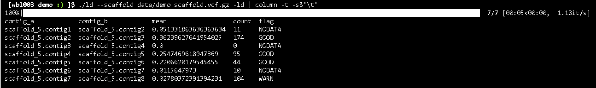
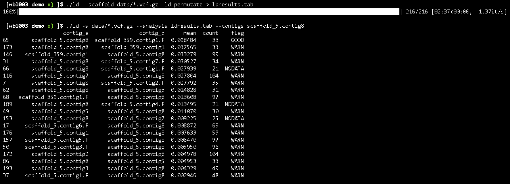
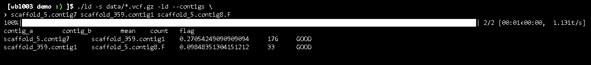

# LD Checker Demonstration


A simple tool to quickly demo the ability to check the linkage disequilibrium between contigs in a scaffold. Provides features such as checking specific configurations or all permutations

### Installation

On Jupyter Terminal 


```bash
$ cd /nesi/project/nesi02659/Hic_practical/working_dir/Username/demo
```
```bash
$ module purge 
```
```bash
$ ./install 
```

The *./install* script will automatically create a python virtual environment with the necessary dependencies. The program should then be able to run by using the `./ld` command.

```bash
$ ./ld 
usage: __main__.py [-h] --scaffolds SCAFFOLDS [SCAFFOLDS ...]
                   [--compute-ld [{inorder,permutate}]] [--threads THREADS]
                   [--analysis [ANALYSIS [ANALYSIS ...]]]
                   [--contigs CONTIGS [CONTIGS ...]]
__main__.py: error: the following arguments are required: --scaffolds/-s
```

### Sample Data

Inside the extracted demo folder is another ***/data*** folder that should contain the following files:

```bash
$ ls data/

demo_contig.contigs  demo_contig.vcf.gz  demo_contig.vcf.gz.tbi  demo_scaffold.contigs  demo_scaffold.vcf.gz  demo_scaffold.vcf.gz.tbi
```

The two sets of data are demo_scaffold.vcf.gz and its index file containing the variants and genotype information mapped to a pre assembled scaffold. The file ***demo_scaffold.contigs*** is a text-based index containing the information about where the contig breaks are within the scaffold, this file is specific to this program. The remaining files for demo_contig.* are the same as for ***demo_scaffold*** but only contain information for one contig to be used as an example in this demonstration.

* * *
## Explanation

### Goals 

* We have a large number of scaffolds, each with many contigs
    * For this demo we will be looking at a single small scaffold, with a separate contig to see how we might fit it in.
* We want to evaluate how good the LD is across the existing LD joins
* If we identify any bad joins, we will then want to evaluate if there are any other configurations that would improve the overall LD

### How are joins evaluated?

Each join between two contigs is tested separately. The variants for each contig are extracted and placed into a newly generated VCF file. This process offsets the positions of the variants in one or both of the files in order to simulate the contigs being placed next to each other. This VCF file is then run through PLINKs LD calculation with a setting to compare all markers within a range of 1000 kilo-base pairs or a maximum of 20 other variants (these are standard plink settings).

The resulting PLINK LD calculations are then read back in. Each variant is then checked that it has a median LD of other variants within the contig of greater than 0.20. This is to remove variants that just tend to have poor LD with everything generally (this also does mean that some contigs do not have enough data to evaluate whether a join is good or not).

Finally all variants that have good LD within a contig are checked for LD to variants across the contig boundary. The mean, median, stddev, and more statistics of these are calculated to form a score. It was found that mean tended to the best measure and is what is displayed in this program.

Through testing of randomly creating artificially bad joins it was found that the bad join would likely have a mean LD of less than 0.04. Higher LD is either good or indeterminate. Additionally, joins where less than 10 variants are used for the comparison across contig boundaries are considered indeterminate due to limited data

### Demonstration

#### Step 1. Evaluate the current scaffold

We have a scaffold where we want to evaluate the quality of the joins between the contigs ***data/demo_scaffold.vcf.gz***. To do this we load it as a dataset and ask the program to compute the LD in order. This can be done with the following command:

```bash
$ ./ld --scaffold data/demo_scaffold.vcf.gz -ld
```
OR Use the below command to format the resulting output better

```bash
$ ./ld --scaffold data/demo_scaffold.vcf.gz -ld | column -t -s$'\t'
```
This should produce output that looks like the following:



From this we can see that most of our joins are either good or indeterminate (not enough data). However one join between contig7 and contig8 has been flagged with a warning due to a large number of variants that all have poor LD across the contig boundary.

#### Step 2. Finding better options

The next step we would take here would be to test all possible configurations of all contigs. For a whole genome this can scale to millions of permutations and take several thousand CPU hours on a system like NeSI. For this demo, we will only be testing the simple scaffold with an additional contig. This should run within a few minutes on many devices.

To test all permutations we need to load in all contigs, and instruct the program to test all permutations rather than just those in order:

```bash
$ ./ld --scaffold data/*.vcf.gz -ld permutate > ldresults.tab
```

>Note that by default the program will output all configurations directly to the terminal similar to the output from the first command. We can pipe this to a file (you can open it and take a look if you would like), and then the program will then allow us to load in and query the results later.

Once all the permutations have been calculated, we can then query for the best joins for a particular contig. Specifically we want to see if we can do better for contig7 and contig8. We address contigs with the format ***scaffold.contig***[.F] with the .F being optional and indicating that that contig has been flipped. So to find all the best joins for contig8 we can load in the previous results file and run the following command:

```bash
$ ./ld -s data/*.vcf.gz --analysis ldresults.tab --contigs scaffold_5.contig8
```
>Note: -s is just shorthand for --scaffold



This will print a list of the top scoring joins for that particular contig. From this we can see, that contig8 scores pretty badly with everything else within the same scaffold. The only contig it scores well with is the new one we introduced in our permutations ***scaffold_365.contig1***. In this case the contig has been flipped. The program when permuting will avoid duplicate configurations, so **scaffold_5.contig8 -> scaffold_359.contig1.F** is the same as **scaffold_359.contig1 -> scaffold_5.contig8.F** as the same end of both contig is touching the other.

It may take a little bit to understand what is going on here, but from experience we might be able to intuit that contig8 should be flipped, and the new contig should be inserted before it

### Step 3. Test the adjusted scaffold

Finally, we want to test whether our suggested changes will have any impact. We can use the same command we started with to test the contigs in order, but instead provide our own list of contigs to test. In this case we want to see if the arrangement of **scaffold_5.contig7 -> scaffold_359.contig1 -> scaffold_5.contig8.F** (flipped) is better than the original configuration of **scaffold_5.contig7 -> scaffold_5.contig8**.

To test the new arrangement we can run the following command:

```bash
$ ./ld -s data/*.vcf.gz -ld --contigs \
scaffold_5.contig7 scaffold_359.contig1 scaffold_5.contig8.F
```



From this we can see that using our original metrics the new configuration is much better! Feel free to play around with finding other adjustments to the scaffold (does rearranging/flipping any of the other contigs give something better even if they are already ‘good’?)
